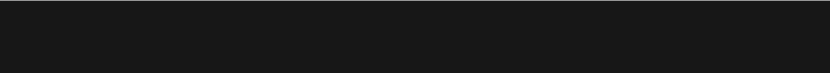
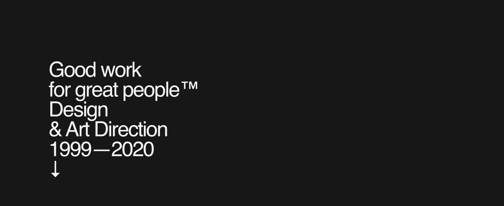
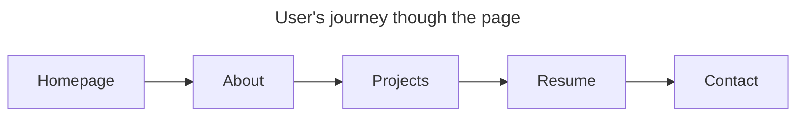

<!-- Markdown cheat sheet for reference:
https://github.com/adam-p/markdown-here/wiki/markdown-cheatsheet -->

# Brian Joseph's Portfolio
This repository was created to maintain the source code of a developer portfolio that is well-designed and functional. In other words, a portfolio that was made to work good and also look good. This site was created using the [T3 Stack](https://create.t3.gg/), drew on inspiration from [Erik Jonsson's portfolio](https://erikjonsson.se/), and is currently deployed to Vercel.

## Design References
### UI/UX Design Fundamentals
- [World's shortest UI/UX design course (6mins)](https://www.youtube.com/watch?v=wIuVvCuiJhU)
- [World's shortest figma course (6mins)](https://www.youtube.com/watch?v=1pW_sk-2y40)

### Stock images/videos
- [Pexels (Free hi-res stock images and videos)](https://dribbble.com/)
- [Unsplash (Free hi-res stock images)](https://unsplash.com/)

### Design Examples & Inspiration
- [Dribbble](https://dribbble.com/)
- [Behance](https://www.behance.net/)

### Design Tools
- [Realtime Colors for testing themes and fonts](https://www.realtimecolors.com/)
- [Typescale for finding good ratios for fonts](https://typescale.com/)
  
  
## Functional Requirements
We need easy access to the following sections

1. Contact
   - linkedIn
   - github
   - email
2. About/Bio
3. Skills
4. Projects
5. Resume

## Design Research 
We've gathered some observations from the reference/source material

### Fonts: Sans-serif for everything
  - BasisGrotesque-Regular for main text (nav, hero text)
    - backups: sans-serif

  - Helvetica Medium for subheadings
    - backups: Helvetica, Arial, sans-serif

### Font Styling
- Main
  - 42px
  - 400 weight 
  - 40px line height
- Secondary
  

### Colors
- Background: black rgb(41, 42, 44)
- Text: white rgb(250, 250, 250)
- Text:hover rgb(255, 11, 0)

### Illustrations

1. Navbar seems to descend into view on load:

1. Main text appears one line at a time:

## User flow

## Wireframing
